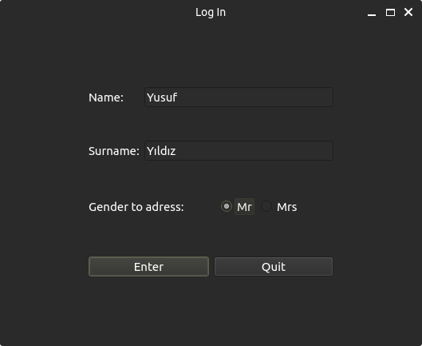
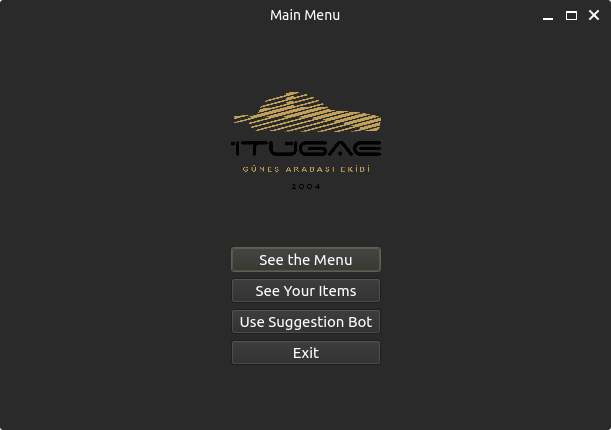
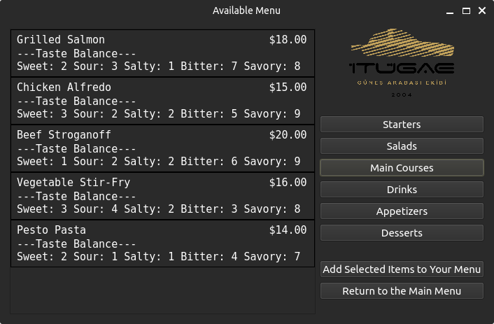
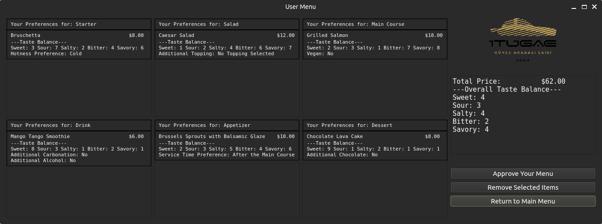
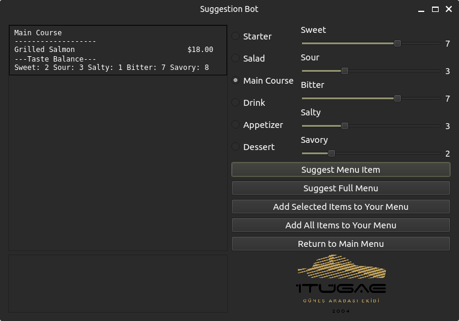
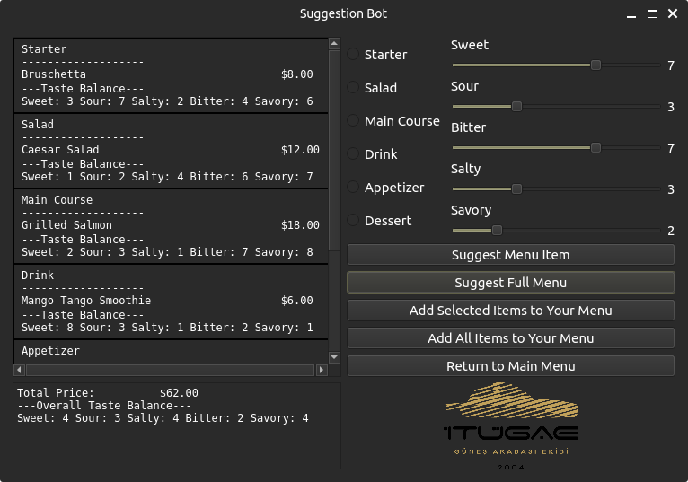
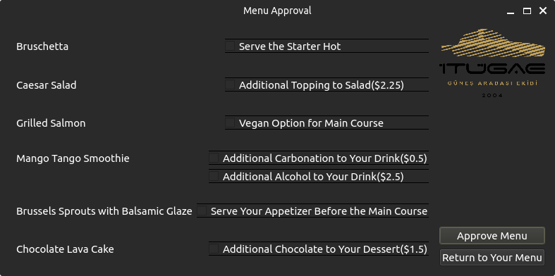

# Restaurant Bot

## Overview
The Restaurant Bot is a sophisticated terminal-based application developed as an assignment for the Istanbul Technical University's ITU ZES Solar Car Team. This project exemplifies the practical application of Object-Oriented Programming (OOP) concepts in C++, particularly focusing on encapsulation, inheritance, and polymorphism, all within the context of a user-interactive command-line interface (CLI). The primary function of this bot is to aid users in assembling personalized meal plans based on individual taste preferences and dietary requirements, streamlining the process of menu selection with an intuitive, dialogue-based system.

## Features
- **User Information Input**: Captures essential details such as the user's name, surname, and preferred title, enhancing personalized interaction throughout the meal selection process.
- **Menu Customization**: Provides a comprehensive selection of dishes including starters, salads, main courses, drinks, appetizers, and desserts, enabling users to compile a customized menu suited to their personal tastes and dietary needs.
- **Taste Balance**: Empowers users to articulate their taste preferences across five dimensions: sweet, sour, salty, bitter, and savory. The application utilizes these preferences to recommend dishes that align with the user’s unique taste profile.
- **Menu Suggestions**: Utilizes an intelligent suggestion mechanism that proposes individual dishes or a complete menu tailored to the user's specified taste preferences, significantly simplifying the decision-making process.
- **Price Calculation**: Dynamically calculates the total price of selected menu items, factoring in any additional customization options such as extra toppings or dietary adjustments (e.g., vegan options).
- **Menu Approval**: Allows users to review their final selections and make any necessary adjustments before finalizing their menu, ensuring complete satisfaction with the chosen meal plan.

### 1. **Login Screen**
This introductory screen is the gateway to the Restaurant Bot application. Users are required to enter their personal information, specifically their first name and last name, into the designated text fields. Additionally, users select their preferred form of address (Mr. or Mrs.) through radio buttons, ensuring interactions within the application are personalized and respectful. The interface is straightforward, offering clear instructions and two primary options: "Enter" to proceed with the entered information, and "Quit" to exit the application. This initial interaction sets the tone for user experience, emphasizing simplicity and user-friendliness.

  

 - **Name Field**: A text box where the user enters their first name.
 - **Surname Field**: A text box for entering the user's last name.
 - **Gender to Address**: Radio buttons allowing the user to select "Mr" or "Mrs" as the form of address, ensuring personalized interaction throughout the application.
 - **Enter Button**: Confirms the entered information and proceeds to the Main Menu.
 - **Quit Button**: Exits the application, useful for users who decide not to proceed for any reason.

### 2. **Main Menu**
Upon successful login, users arrive at the Main Menu, which represents the heart of the application. This screen features the ITU ZES Solar Car Team's logo, reinforcing the project's academic and team-oriented background. The main menu is designed with clear, concise options that guide the user through the application: "See the Menu" to browse the full list of available dishes, "See Your Items" to view selected items, "Use Suggestion Bot" for automated, personalized menu recommendations, and "Exit" to leave the application. This screen is pivotal, as it directs users to the various functionalities of the Restaurant Bot, allowing for an intuitive and efficient navigation experience.

 - **See the Menu Button**: Transitions to the Available Menu screen, allowing users to browse the restaurant's offerings.
 - **See Your Items Button**: Displays the User Menu screen, where users can review items they have previously selected.
 - **Use Suggestion Bot Button**: Leads to the Suggestion Bot Interface, guiding users through a personalized menu creation process based on their taste preferences.
 - **Exit Button**: Closes the application, providing a clear and accessible way to end the session.

### 3. **Available Menu**
This screen showcases the range of dishes available within the Restaurant Bot's database. Each menu item is listed alongside its price and a detailed "Taste Balance" profile, which includes metrics such as sweetness, sourness, saltiness, bitterness, and savoriness. This feature is particularly useful for users with specific dietary preferences or those looking to explore different flavor profiles. Additionally, the interface includes options to navigate back or add selected items to the user's personal menu, facilitating a seamless selection process.

 
 
 - **Menu Items List**: Displays available dishes with details such as name, price, and taste balance (sweet, sour, salty, bitter, savory).
 - **Add Selected Items to Your Menu Button**: Adds the user's chosen dishes to their personal menu for later review.
 - **Return to the Main Menu Button**: Allows users to navigate back to the Main Menu without making any selections.

### 4. **User Menu**
After selecting items from the available menu, users can review their personalized menu on this screen. It lists all chosen items along with specific user preferences for each dish (e.g., temperature for starters, additional toppings for salads). This screen also displays the total cost, allowing users to make informed decisions based on their budget. The interface enables users to approve their menu or return to previous screens to make changes, providing a flexible and user-centric decision-making environment.

  
  
 - **List of Selected Items**: Shows dishes that the user has added to their menu, along with customization options selected for each item.
 - **Total Price**: The cumulative cost of all selected items, reflecting any additional customizations.
 - **Approve Your Menu Button**: Finalizes the menu choices and proceeds to the Menu Approval screen.
 - **Remove Selected Items Button**: Removes selected items from the user's menu, allowing for adjustments before final approval.
 - **Return to the Main Menu Button**: Brings the user back to the Main Menu to continue exploring options.

### 5. **Suggestion Bot Interface**
In this innovative section of the application, users can fine-tune their taste preferences using sliders for different flavor profiles: sweet, sour, salty, bitter, and savory. This input directly influences the Suggestion Bot's algorithm, which is designed to tailor menu recommendations according to these specified tastes. This feature exemplifies the application's commitment to providing a customized dining experience, catering to the unique preferences of each user.
 
  
 
 - **Taste Preferences Sliders**: Allows users to set their preferences for sweet, sour, salty, bitter, and savory tastes, influencing the bot's menu suggestions.
 - **Suggest Menu Item Button**: Commands the bot to suggest a single dish based on the adjusted taste preferences.
 - **Suggest Full Menu Button**: Instructs the bot to compile a complete menu tailored to the user's taste preferences.
 - **Return to Main Menu Button**: Lets users exit the Suggestion Bot interface and return to the Main Menu.

### 6. **Suggestion Bot Results**
Following user input on the Suggestion Bot Interface, this screen presents the bot's menu recommendations, which are aligned with the user's taste preferences. Each suggested dish is listed with a brief description and price, offering users a glimpse into how each item complements their flavor profile. Users can choose to accept the bot's suggestions in full, modify them, or start the recommendation process anew, demonstrating the application's adaptability and user-friendly design.
 - **Suggested Items List**: Displays the dishes suggested by the bot, aligned with the user's taste preferences.
 - **Add Selected Items to Your Menu Button**: Adds the bot's suggested dishes to the user's menu.
 - **Add All Items to Your Menu Button**: Quickly adds all suggested dishes to the user's menu.
 - **Return to the Suggestion Bot Button**: Goes back to the Suggestion Bot Interface for taste preference adjustments or new suggestions.
 - **Return to the Main Menu Button**: Returns to the Main Menu for further exploration or action.

 

### 7. **Menu Approval**
The final step in the user's journey within the Restaurant Bot application, this screen is dedicated to reviewing and finalizing the menu selections. Each chosen item is listed with options for additional customizations that might affect the overall price (e.g., adding extra chocolate to desserts or extra shots to drinks). The total cost is updated in real-time, reflecting any changes made. This screen ensures that all selections and customizations meet the user's satisfaction before final approval, emphasizing the application's focus on precision and user satisfaction.
 - **Final Review List**: Shows all selected items along with their specific customizations and additional costs.
 - **Approve Menu Button**: Confirms all selections and customizations, finalizing the user's menu.
 - **Additional Options Checkboxes**: Allow users to apply last-minute additions or changes to their menu, such as extra toppings or modifications to dishes.
 - **Return to Your Menu Button**: Sends the user back to the User Menu for any last-minute changes before finalizing.

 

Each screen and its associated features are designed to navigate users through the process of customizing their dining experience with ease, ensuring a smooth and intuitive interaction with the Restaurant Bot application.

## Installation and Setup
1. Clone the repository to your local machine.
2. Ensure a C++ compiler is installed on your system.
3. Compile the code by navigating to the project directory and using the C++ compiler commands.
4. Execute the compiled application to start interacting with the Restaurant Bot.

## Usage
Navigate through the application by following the on-screen prompts:
1. Input user details for a personalized experience.
2. Explore the full menu or utilize the Suggestion Bot for guided selections.
3. Customize and finalize your personal menu.
4. Approve the final menu and enjoy a tailored dining experience.

## Contact
Should you encounter any issues or have questions regarding the Restaurant Bot, please reach out to Yusuf YILDIZ at [yousufy1ld1z@gmail.com](mailto:yousufy1ld1z@gmail.com).

