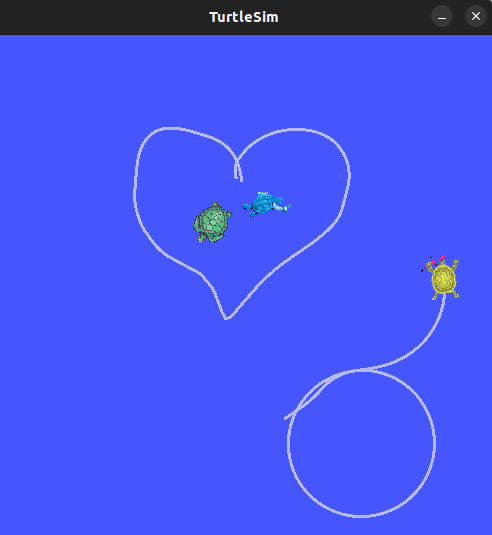

---

# Image Filterer and Joystick-Controlled Turtlesim

## Overview
This project combines image processing with OpenCV filters and a joystick-controlled turtlesim simulation to demonstrate various ROS2 concepts such as publishers, subscribers, services, and OpenCV usage. The project allows you to interact with a simulated turtle using a joystick and apply image processing filters to video data using OpenCV.

## Installation
1. **ROS2 Humble**: Ensure you have ROS2 Humble installed on your system. Refer to the [official ROS2 installation guide](https://docs.ros.org/en/humble/Installation.html) for detailed instructions.
2. **Dependencies**: Install the required dependencies, including OpenCV and cv_bridge:
    - **OpenCV** is used for image processing tasks.
    - **cv_bridge** provides a bridge between OpenCV and ROS2 image messages.
3. **Cloning the Repository**: Clone this repository and navigate to your ROS2 workspace's root directory.
4. **Building the Project**: Build the project using `colcon build` in your ROS2 workspace.
5. **Setting Up the Environment**: After building the project, set up the environment by running `source ./install/setup.bash`.

## Usage
### Image Processing with OpenCV Filters
- **Running the Nodes**: Start the image processing nodes using the following commands:
    ```bash
    ros2 launch sct_img_filter img_pub_filter.launch.py 
    ```
- **`ImagePublisher` Class**:
    - The `img_publisher` node reads frames from a video file and publishes them as `sensor_msgs::msg::Image` messages at a frequency specified in the YAML configuration file.
    - Parameters such as video file path and publishing frequency are set in the YAML file.
    - The `timer_callback()` function reads frames from the video file and publishes them as ROS2 image messages.

- **`ImageFilterer` Class**:
    - The `img_filterer` node subscribes to the image topic and applies OpenCV filters such as Gaussian blur, grayscale conversion, and Canny edge detection to the images.
    - `image_callback()` function converts received images to OpenCV format and applies selected filters based on parameters.
    - Filtered images can be displayed or published based on options set in the YAML file.
    - Parameters include enabling/disabling filters, filter options, and whether to publish or display the filtered images.

<p align="center">
  
</p>

### Joystick-Controlled Turtlesim
- **Running the Node**: Start the joystick controller node in addition to turtlesim and Joy nodes using:
    ```bash
    ros2 launch sct_turtlesim_joy_controller start_all.launch.py 
    ```
- **Functionality**: The joystick controller node subscribes to the `/joy` topic to receive joystick inputs and controls the turtlesim simulation accordingly. Various joystick buttons and axes map to different functionalities:

- **`JoyControllerNode` Class**:
    - `joy_callback()` function processes joystick inputs and performs actions such as:
        - **Button Mappings**: Allow you to clear and reset the turtlesim environment, spawn new turtles, set pen properties, and more.
            - Button A (index 0): Clears the turtlesim background.
            - Button B (index 1): Resets the turtlesim to its starting configuration.
            - Button X (index 2): Spawns a new turtle at the current position and orientation.
            - Button Y (index 3): Controls the turtle's pen color, width, and state (on/off).
        - **Axis Mappings**: Axes control the turtle's linear and angular velocities, enabling you to navigate the turtle smoothly.
            - Right trigger (axis 5): Controls the turtle's linear velocity.
            - Left stick (axis 0): Controls the turtle's angular velocity.
    - `pose_callback()` function updates the turtle's pose based on pose data received from the `/turtle1/pose` topic.
    - `timerCallback()` function ensures proper handling of events triggered by the joystick.

<p align="center">
  
</p>

## Configuration
- **YAML File**: Use a YAML configuration file to specify parameters for the project, such as the video file path, publishing frequency, OpenCV filter parameters, and joystick mappings.
- **Parameters**: Define parameters such as enabling/disabling specific filters, their configuration (e.g., kernel size for Gaussian blur), and whether to publish or display the filtered images.

## Project Structure
- **Nodes**: The project consists of multiple nodes:
    - **`ImagePublisher` Node**: Publishes video frames as ROS2 image messages at a specified frequency.
    - **`ImageFilterer` Node**: Subscribes to the image messages and applies OpenCV filters based on the provided parameters.
    - **`JoyControllerNode`**: Subscribes to joystick inputs and controls the turtlesim simulation accordingly.

## Credits
- Give credits to my colleague [Umut Ozkan](https://github.com/umut-ozkan) for his contribution to this project.

## Contact
- Should you encounter any issues or have questions regarding the Restaurant Bot, please reach out to Yusuf YILDIZ at [yousufy1ld1z@gmail.com](mailto:yousufy1ld1z@gmail.com).
